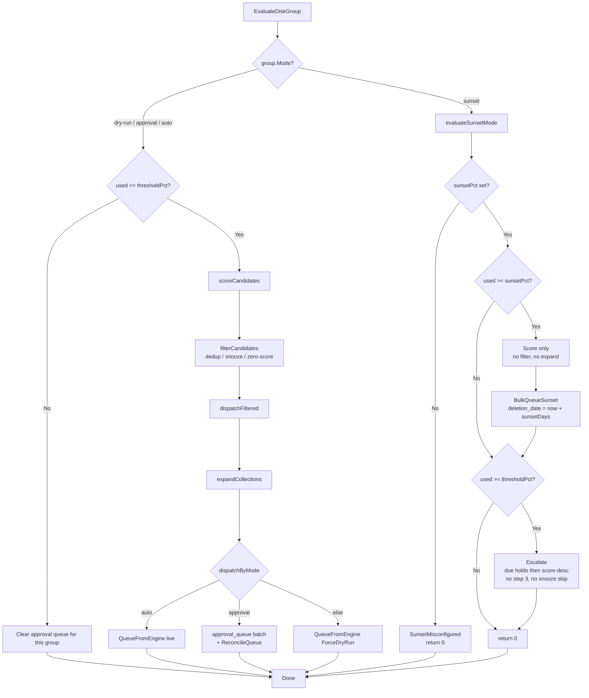
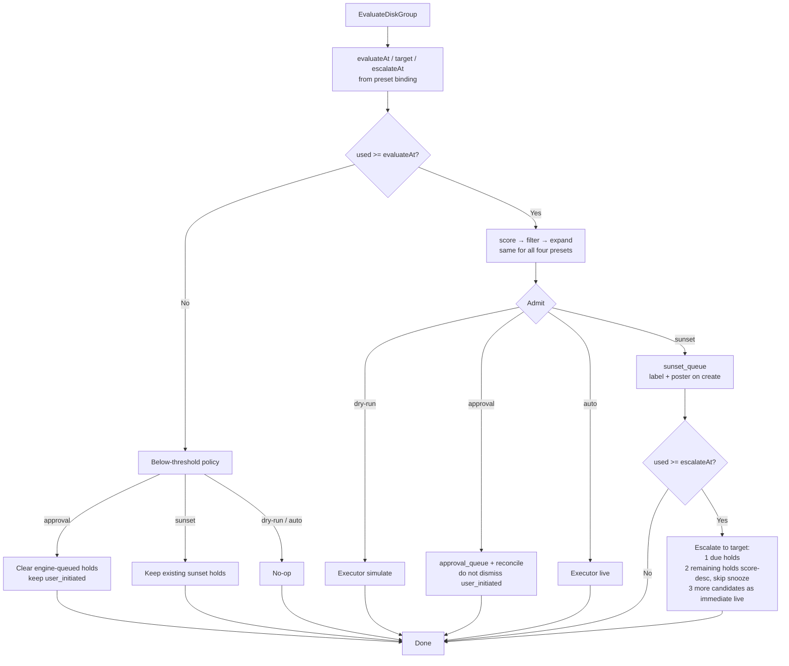
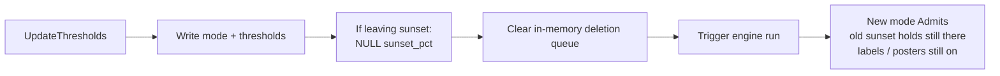
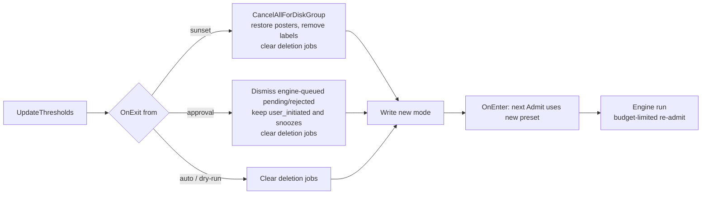
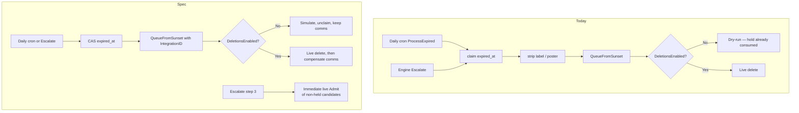

# Four-Mode Spec

**Status:** Draft (spec + slices A–J on this PR)
**Priority:** High (architecture + trust)
**Origin:** Principal-engineer review of `dry-run` / `approval` / `auto` / `sunset`

This is the behavior spec for all four execution presets. Implementation continues on this same PR / branch (`feature/four-mode`). If a later slice disagrees with a row here, change this file in the same commit.

**Implementing?** Start at [`20260924T0340Z-four-mode-handoff.md`](./20260924T0340Z-four-mode-handoff.md). A–J are on this branch. Do not redesign from this file. Do not open a new branch.

---

## 1. What a mode is

A disk-group mode is a **preset** of three policies, not a separate engine.

| Axis | Question | Values |
|---|---|---|
| **Authorization** | Who may release a delete? | `observe` / `human` / `machine` |
| **Timing** | When may it fire? | `immediate` / `hold-until-click` / `hold-for-duration` (breakable at escalate) |
| **Communication** | Who is told while it waits? | `audit` / `in-app` / `media-server` |

User-facing pills stay four names. Internals bind those names:

| Preset | Auth | Timing | Comms |
|---|---|---|---|
| `dry-run` | observe | immediate (simulate) | audit |
| `approval` | human | hold until click | in-app |
| `auto` | machine | immediate (live) | audit + deletion queue |
| `sunset` | machine | hold `sunsetDays`, breakable at `escalateAt` | media-server + in-app |

Do not add a fifth pill in this work. Combinations the enum cannot express (observe-the-sunset-path, warn-then-still-approve, drain-to-empty) are out of scope. See §12.

`DefaultDiskGroupMode` is only the default for newly discovered groups. It is never the runtime mode of an existing group.

---

## 2. Shared machine (all presets)

Every engine cycle for every group:

```text
measure disk
  → if used >= evaluateAt: score → filter → expand    // identical for all presets
  → Candidate[]                                       // same titles dry-run would have shown
  → Admit(candidates, holdBudget)                     // preset chooses sink
  → if used >= escalateAt && preset has duration-hold: Escalate()
  → executor.Enqueue(actions)
  → holds.Create(holds) + comms.Apply()
```

Rules:

1. **Decide is pure.** Scoring, protection rules, show/season dedup, snooze skip, collection expand — no I/O sinks, no mode `switch` inside the evaluator.
2. **Dry-run is the same Admit with the actuator off.** If dry-run and another preset can select different titles on the same library + weights + rules, the observe path is wrong.
3. **Preview is not dry-run.** Preview scores the full library for the UI. Dry-run only *admits* when `used >= evaluateAt`. Do not conflate them.
4. **One executor.** `DeletionService` is the only path that calls *arr delete. Origin (engine / approval / sunset / manual) is metadata on the job.
5. **Identity** is `(integration_id, external_id)` scoped by `disk_group_id`. Never `title + type`.
6. **Mode change** is `OnExit(from)` then `OnEnter(to)`, then an engine run that admits under the *new* preset. Do not convert one hold type into another. Do not delete the entire old hold set as live actions.

Sunset must not early-return before score/filter/expand. `evaluateSunsetMode` as a private scorer is not allowed by this spec.

---

## 3. Threshold model (all presets)

Every disk group has three numbers. Meaning does not flip with the preset.

| Number | Meaning | Storage today |
|---|---|---|
| `evaluateAt` | Start selecting candidates | `thresholdPct` (non-sunset) or `sunsetPct` (sunset) |
| `target` | Byte budget for *actions* = used − target | `targetPct` |
| `escalateAt` | Break duration-holds and take more | `thresholdPct` (sunset only) |

Preset bindings:

| Preset | evaluateAt | escalateAt | Hold budget | Action budget |
|---|---|---|---|---|
| dry-run, approval, auto | `thresholdPct` | unused (`== evaluateAt`) | n/a | used − target |
| sunset | `sunsetPct` | `thresholdPct` | used − evaluateAt | used − target |

Validation (sunset only, save-time, keep `ValidateSunsetConfig`):

```text
sunsetPct is non-null
sunsetPct < targetPct < thresholdPct
```

`sunsetPct == NULL` + mode `sunset` → refuse to evaluate, publish `sunset_misconfigured`. Do not invent a default of `0`.

Column rename to `evaluateAt` / `escalateAt` is *not* required to implement this spec. The names are the model. Storage can stay `threshold_pct` / `sunset_pct` until a later migration.

Absolute byte thresholds (backlog plan) must implement this same model (bytes instead of percent). They must not add a second `if` beside a sunset-only evaluator.

---

## 4. Holds

A hold is “this title is selected and not yet an action.”

| Preset | Hold table | Release |
|---|---|---|
| dry-run | none | n/a (action is simulate, now) |
| approval | `approval_queue` | user approve |
| auto | none | n/a (action is live, after executor grace) |
| sunset | `sunset_queue` | `deletion_date <= now` **or** escalate |
| all | `approval_queue` (rejected + `snoozed_until`) | `snoozed_until <= now` |

Keep two tables. Sunset’s side-effect columns would pollute approval queries. Share the protocol, not the schema:

- **Admit** — create hold or action
- **Release** — hold → executor
- **Exit** — compensate + delete or dismiss holds for this group
- **Compensate** — undo comms (labels, posters)

Executor grace (`deletionQueueDelaySeconds`, 10–300s, default 30) is a last-metre undo window in front of *live* actions. It is not a fifth mode and not a substitute for sunset’s day-scale hold.

### 4.1 Approval hold rules

| Event | Rule |
|---|---|
| Admit | Upsert pending. Engine items get `user_initiated = false`. |
| Cycle reconcile | Dismiss pending engine items whose identity is not in this cycle’s admitted set. **Do not dismiss `user_initiated`.** (Today `ReconcileQueue` dismisses any pending not in `neededKeys`, including user-initiated. That is a spec defect.) |
| Below `evaluateAt` | `ClearQueueForDiskGroup`: delete pending + rejected, `user_initiated = false` only. |
| Approve | Enqueue to executor first, then CAS pending → approved. Queue-full leaves the row pending. |
| Reject | pending → rejected, set `snoozed_until`. |
| Kill-switch dry-run of an approved item | Return row to pending. Do not consume the hold. |
| Crash with approved + no job | `RecoverOrphans` → pending. |

### 4.2 Sunset hold rules

| Event | Rule |
|---|---|
| Admit | Insert if identity not already held. `deletion_date = now + sunsetDays` (stamp at admit; later `sunsetDays` changes do not rewrite existing dates). |
| Below `evaluateAt` | **Keep** holds. The household promise stands. |
| Daily cron | Release due holds (`deletion_date <= now` and not saved). Refresh posters. Optional rescore (§9). Cleanup saved. |
| Escalate | §9.2 |
| Cancel / clear / reschedule | User actions on the hold. Cancel and clear compensate comms. |
| Unique | `(disk_group_id, integration_id, external_id)` unique. |
| Status | `pending` while counting down; `saved` if rescued; **`expired` written on successful handoff** (constant exists today; nothing writes it). `expired_at` remains the CAS token. |

### 4.3 Snooze hold rules (all presets)

Snooze is a hold, not an approval-only hack.

- Admit **skips** snoozed identities. Lookup failure is fail-closed: do not admit, do not escalate.
- Escalate **skips** snoozed identities. (Today `Escalate` does not. Spec requires it.)
- Snooze can be created from approval reject or from the deletion-queue snooze action.
- After `snoozed_until`, the title is eligible again. It does not automatically re-enter a queue until the next Admit.

---

## 5. Executor

Applies to every live or simulated action, every origin.

| Rule | Spec |
|---|---|
| Intent | Write `pending_delete` before the *arr call. On *arr failure, fail the intent (do not leave `pending_delete` for a file still on disk). On success + `MarkDeleted` failure, keep the intent (already correct). |
| Kill switch | Re-read `DeletionsEnabled` at process time. If false, simulate. **Never consume a hold** as a side effect of simulating. |
| Preset change | If `EnqueuedMode != current group mode`, cancel the job. Defense in depth — Exit must have already compensated holds. |
| Dry-run job | `ForceDryRun` writes upserting dry-delete audit. No *arr delete. |
| Grace | 10–300s after the last queue mutation, then rate-limited drain. |
| Cap | In-memory 500. On full: stop further Admit for that group this cycle; record `QueueFullSkipped`; do not silently skip. |
| `SignalBatchSize` | Count of actions this cycle that the executor will process, **including sunset releases and escalations admitted during the engine cycle.** `SignalBatchSize(0)` is only legal when nothing was handed over. |
| Batch complete | Second gate of the cycle digest. Sunset-only cycles that escalate must not fire an empty batch-complete. |
| Freed bytes | Auto increments per successful live delete. Cycle estimate is not written on top of that. Mixed-mode: per-group numbers are source of truth; do not zero a non-auto group’s estimate because a sibling group is auto. |

`QueueFromSunset` must populate `MediaItem.IntegrationID` (today it does not). Intake shapes must match `QueueFromApproval`.

---

## 6. Behavior matrix

Rows are events. Cells are required behavior. **CHANGE** marks a difference from today.

### 6.1 Engine cycle

| Event | dry-run | approval | auto | sunset |
|---|---|---|---|---|
| `used < evaluateAt` | No admit. | Clear engine-queued pending/rejected. | No admit. | No new admits. **Existing holds stay.** |
| `evaluateAt <= used < escalateAt` | Score → filter → expand → simulate actions for action budget. | Same candidates → approval holds. Reconcile. | n/a (`escalateAt == evaluateAt`) | Score → filter → expand → sunset holds for **hold budget** (used − evaluateAt). No live delete. |
| `used >= escalateAt` | Same as evaluate (immediate simulate). | Same as evaluate (holds). | Score → filter → expand → live actions for action budget. | Admit new holds (hold budget) **and** Escalate (§9.2) for action budget. |
| Snooze lookup fails | Abort group. No actions. | Abort group. | Abort group. | Abort group (no admit, no escalate). |
| Same library + weights | Candidate set A | Candidate set A | Candidate set A | Candidate set A **CHANGE** (today sunset skips filter/expand) |

### 6.2 Manual delete (library “delete” click)

User-initiated removal uses the **group’s authorization**. It is not a bypass.

| Preset | Spec | Today |
|---|---|---|
| dry-run | Simulate (`ForceDryRun`). | Same. |
| approval | `user_initiated` approval hold. Must be approved from the queue. | Same. |
| auto | Live action (kill switch + grace still apply). | Same. |
| sunset | `user_initiated` sunset hold, same `sunsetDays`. Not a live delete. **CHANGE** (today `QueueManual` only special-cases approval; sunset is live). | Live. |

If the title is already in that group’s sunset hold, manual delete is a no-op on membership (already held). User may reschedule or cancel from the sunset queue.

A later “delete now” control is out of scope. Switching the group to auto is the way to make the *engine* live; it does not convert existing sunset holds into deletes (§7).

### 6.3 Kill switch (`DeletionsEnabled = false`)

The brake is **executor-global**. It sits above every sink.

| Origin | Spec |
|---|---|
| Auto live job | Simulate. |
| Approval-approved job | Simulate, then `ReturnToPending`. |
| Sunset-released job | Simulate, **unclaim `expired_at`**, status stays `pending`. Do not strip labels/posters as if the delete happened. **CHANGE** (today claim happens before handoff; dry-run leaves the hold consumed and labels already removed). |
| Dry-run preset | Already simulating. Brake is redundant and harmless. |
| In-flight queue | Process-time re-read. Turning the brake off mid-drain converts remaining jobs to simulate. Turning it on does not rewrite already-simulated audit rows. |

Turning the brake **on → off** clears the in-memory deletion queue (already implemented). Keep that.

### 6.4 Snooze

| Event | All presets |
|---|---|
| Admit | Skip snoozed identity. |
| Escalate | Skip snoozed identity. **CHANGE** for sunset. |
| Manual delete | Allowed. Snooze is “engine, leave this alone,” not “human may not touch it.” |
| Expire | Eligible next Admit. |

### 6.5 Collections

If the source integration has `collectionDeletion` on, `expandCollections` runs for **all four presets**, including sunset. **CHANGE** for sunset (today it sets `CollectionGroup: ""` and never expands).

A protected or snoozed member skips the whole collection (current auto/approval/dry-run behavior). Keep it.

Sonarr `ShowLevelOnly` virtual override when the integration is linked to **any** sunset group stays (§10). That is fetch-time shape (shows vs seasons), not a second Admit path.

---

## 7. Transition table

`OnExit` runs before the column write is observable to the next engine run. `OnEnter` is “next Admit uses the new preset” plus the existing triggered run.

Never convert holds into a different hold type. Never dump the old hold set into the executor as live deletes. The new preset re-admits under its own budget.

| From \ To | dry-run | approval | auto | sunset |
|---|---|---|---|---|
| **dry-run** | — | Clear in-flight dry-run jobs. Next Admit → approval holds. | Clear in-flight. Next Admit → live. | Clear in-flight. Next Admit → sunset holds if `used >= sunsetPct`. |
| **approval** | Exit approval (§7.1). Next Admit → simulate. | — | Exit approval. Next Admit → live (gate is gone). | Exit approval. Next Admit → sunset holds. |
| **auto** | Cancel in-flight live jobs (`EnqueuedMode` + queue clear). **Safety.** Next Admit → simulate. | Cancel in-flight. Next Admit → approval holds. | — | Cancel in-flight. Next Admit → sunset holds. |
| **sunset** | Exit sunset (§7.2). Next Admit → simulate. | Exit sunset. Next Admit → approval holds. | Exit sunset. Next Admit → live. **Does not instantly delete the old sunset set.** | — |

In-flight means the executor’s in-memory queue for that `disk_group_id`.

### 7.1 Exit approval

| Hold / job | Action |
|---|---|
| Engine-queued pending / rejected | Dismiss (same rules as `ClearQueueForDiskGroup`). |
| `user_initiated` pending | **Keep.** Still approvable from the approval queue even if the group is no longer `approval`. |
| Active snooze (rejected + `snoozed_until`) | **Keep.** All presets honor it. |
| Approved + in-flight | Cancel via `EnqueuedMode` / queue clear. `RecoverOrphans` or explicit return-to-pending so the row is not stuck `approved`. |
| Comms | None (approval has no media-server side effects). |

Today mode change clears the deletion queue and triggers a run. It does not dismiss engine-queued approval rows. The triggered run reconciles only if the *new* mode is still approval. **CHANGE:** Exit approval must dismiss engine-queued pending/rejected itself, so approval → auto does not leave a stale queue beside live deletes of the same titles.

### 7.2 Exit sunset

| Hold / job | Action |
|---|---|
| All sunset rows for the group | `CancelAllForDiskGroup` with real `SunsetDeps`. |
| Labels / posters | Restore originals, remove sunset and saved labels. |
| In-flight sunset jobs | Clear deletion queue for the group. |
| Cron | Subsequent `ProcessExpired` finds nothing. |

**A shipped** on this PR: `UpdateThresholds` writes the new mode, then `SunsetGroupExiter.Exit` → `CancelAllForDiskGroup`, then clears the deletion queue, then `TriggerRun`. Rows still delete if label/poster restore fails.

Publish a per-group mode-changed event (Important). Today a per-group preset change only emits `threshold_changed`. **CHANGE** (slice E).

---

## 8. Per-preset narrative

### 8.1 Dry-run

Purpose: watch the decision path without mutating the library.

- `evaluateAt = thresholdPct`. No duration-hold.
- Admit → executor simulate + upserting dry-delete audit.
- Below threshold: nothing to clear (no holds).
- Manual delete: simulate.
- Does **not** apply labels or posters.
- Digest: Verbose (`dry_run_digest`). Title “Dry-Run Complete.”
- Tooltip: the engine **does** act — it writes dry-delete audit. “Takes no action” is false. **CHANGE** copy.

Dry-run cannot observe “what would enter sunset” without being sunset. That combination is §12, not this preset.

### 8.2 Approval

Purpose: nothing the *engine* selected is removed until a human clicks.

- `evaluateAt = thresholdPct`. Hold until approve.
- Admit → `approval_queue` pending. Reconcile each cycle (§4.1).
- Below threshold: drop engine-queued pending/rejected.
- Approve → executor (live unless kill switch).
- Reject → snooze.
- Manual delete → `user_initiated` hold (second confirmation is intentional: the preset is “human gate,” and the library click is one human, the queue is the recorded gate).
- Digest: Normal. Title “Items Queued for Approval.”
- Tooltip: current approval tooltip is correct.

### 8.3 Auto

Purpose: capacity management without a human.

- `evaluateAt = thresholdPct`. Admit → live actions.
- Executor grace is the undo window.
- Below threshold: no-op.
- Manual delete → live.
- Queue-full: pause Admit, surface skip count.
- Digest: Normal. Title “Cleanup Complete.” Freed bytes from successful deletes only.
- Tooltip: current auto tooltip is correct.

### 8.4 Sunset

Purpose: warn the household *before* the disk is critical; keep the promise unless usage hits `escalateAt`; still free space if the hold set is not enough.

- `evaluateAt = sunsetPct`. Duration-hold `sunsetDays` (already exists; default 30; 7–90).
- Admit → `sunset_queue` + comms on create (label immediately; poster immediately — **CHANGE**, posters are daily-cron-only today).
- Below `evaluateAt`: keep holds.
- Release: daily cron and/or escalate.
- Manual delete → sunset hold, not live (§6.2).
- Digest: Normal. Content: queued / expired / saved / escalated. Escalation also fires `threshold_breached` (Critical).
- Tooltip and `diskGroupMode.ts`: countdown + escalation, **not** “wind down until empty.” **CHANGE.**
- Misconfigured (`sunsetPct` null): no evaluate, `sunset_misconfigured` as engine error (Critical).

Sunset is not a drain-to-empty mode. If that product is wanted later, it is a new preset.

---

## 9. Sunset-only: comms, escalation, rescore

### 9.1 Comms

| Side effect | When applied | When removed |
|---|---|---|
| Sunset label | Hold create (and refresh-labels for `label_applied = false`) | Cancel, successful live delete, Exit, saved (replaced) |
| Saved label | Rescore save | Saved cleanup, Exit |
| Poster overlay | Hold create; daily refresh of countdown text | Cancel, save (saved badge), successful live delete, Exit |
| Label rename | Settings save → `MigrateLabel` | — |

Apply-fail: hold still exists, `label_applied` / `poster_overlay_active` stay false, retryable. Restore-fail: error the UI can show; do not pretend Exit succeeded.

### 9.2 Escalation ladder

When `used >= escalateAt` on a sunset group, free down to `target` (not to `evaluateAt`).

1. Release already-due holds (`deletion_date <= now`, not saved, not snoozed). Order: score desc.
2. Release not-yet-due holds, not saved, not snoozed. Order: score desc. (Score-first stays; oldest-first was reverted after production mis-ordering.)
3. **If still above target:** Admit additional candidates from the same scored set that are **not** already held, as **immediate live actions** (same filter/expand). **CHANGE** — designed, never shipped.

Without step 3, a small high-value sunset queue cannot meet target. Sunset would fail the reason Capacitarr exists.

Escalation counts as actions for `SignalBatchSize` and as `SunsetEscalated` / `threshold_breached`.

### 9.3 Rescore (“saved by popular demand”)

Keep the product. Implementation today is a stub (preview-cache compare, `weights` discarded, 50% hardcoded).

Spec for the later slice (I) that finishes it:

- Daily, if `sunsetRescoreEnabled`.
- Re-score pending holds through the **engine**, same weights/rules as Admit.
- If current score ≤ 50% of score-at-admit → `saved`, swap labels, saved poster badge, `SunsetSavedEvent`.
- After `savedDurationDays`, compensate saved comms, delete the row. Title may re-enter on a later Admit.
- Do not save on cache-miss. Skip the cycle.

Until that PR, the setting may stay; do not expand it. Do not ship a new heuristic.

---

## 10. Cross-cutting

### 10.1 Mixed groups

Each group is independent. One Sonarr library on two mounts can be auto on A and sunset on B.

UI must not collapse groups into one “most aggressive” runtime mode (`auto > approval > sunset > dry-run`). That shim in `useEngineControl` / dashboard is display compatibility only and must die as a source of behavior. Each card, digest section, and queue uses `group.Mode`.

### 10.2 One integration, two presets

`IsShowLevelOnlyEffective`: stored `ShowLevelOnly` **or** any linked group is sunset (Sonarr only). Keep. Document as fetch-time safety so sunset cannot warn “season 1” and keep season 2. It is not a mode-within-a-mode on Admit.

### 10.3 Notifications

Modes are **not** notification categories. Keep current routing:

| Digest | Tier |
|---|---|
| auto / approval / sunset | `cycle_digest` (Normal) |
| dry-run | `dry_run_digest` (Verbose) |
| sunset escalation | `threshold_breached` (Critical) |
| sunset misconfigured | `error` (Critical) |
| preset change | mode-changed (Important) **CHANGE** (per-group) |

Digest sections are per-group and use that group’s template (§8).

### 10.4 Frontend copy

| Surface | Spec |
|---|---|
| `mode.dryRunTooltip` | Evaluates and writes dry-delete audit; does not remove files. |
| `mode.approvalTooltip` | Keep. |
| `mode.autoTooltip` | Keep. |
| `mode.sunsetTooltip` | Countdown hold + household comms; escalate at critical. Not “until empty.” |
| `diskGroupMode.ts` comment | Same as sunset tooltip. |
| Help page | Already matches sunset spec. Keep. |
| Safety-guard help | Name sunset too: brake simulates auto, approval, **and** sunset releases. |

**B shipped** on this PR.

### 10.5 Rules and protection

`always_keep` and score ≤ 0 never admit, any preset. Collection member with `always_keep` blocks the collection. Unchanged.

### 10.6 Backup / restore

Queues (approval, sunset) are instance state. Export/import of preferences and disk-group **config** (mode, thresholds) must not invent holds. After import, the next engine run Admits under the restored presets. Restoring a backup that includes queue tables is a full DB restore, not settings import.

---

## 11. Vs today (inventory)

| Area | Today | Spec |
|---|---|---|
| Shared pipeline | All four (D) | All four |
| Sunset evaluator | Folded into shared pipeline (D) | Forbidden as a private scorer |
| Sunset filter/expand | Shared filter + collection expand (D) | Required |
| Sunset identity | `(disk_group_id, integration_id, external_id)` unique (F) | `(disk_group_id, integration_id, external_id)` unique |
| `SunsetStatusExpired` | Written on successful handoff (F) | Written on handoff |
| Exit sunset | ✅ Compensate holds + comms (`SunsetGroupExiter`) | Shipped (A) |
| Exit approval | ✅ Dismiss engine-queued pending/rejected; keep user_initiated + snooze (E) | Shipped (E) |
| Escalation step 3 | ✅ Live-admit unheld candidates after steps 1–2 (G) | Shipped (G) |
| Escalate vs snooze | Skips snoozed `MediaKey`s (F) | Skip snoozed |
| Manual delete + sunset | Sunset hold, already-held is no-op (F) | Sunset hold |
| `QueueFromSunset` IntegrationID | ✅ Set on MediaItem | Shipped (C) |
| Kill switch + sunset | ✅ Unclaim, keep comms | Shipped (C) |
| `SignalBatchSize` | ✅ Escalate + step 3 live extras returned from sunset cycle | Shipped (C+G) |
| Posters | ✅ On hold create + daily refresh (H) | Shipped (H) |
| Rescore | ✅ Engine score, same weights/rules as Admit (I) | Shipped (I) |
| Reconcile vs `user_initiated` | Reconcile can dismiss them | Must not |
| Mixed-mode UI | “Most aggressive” shim | Per-group only |
| Sunset tooltip | ✅ Countdown + escalate | Shipped (B) |
| Per-group mode-changed event | Missing | Required |
| Two tables / four pills / kill switch / grace / intent / `EnqueuedMode` / `ValidateSunsetConfig` / ShowLevelOnly override | Present | Keep |

---

## 12. Out of scope

- Fifth pill: observe-sunset, sunset-then-approve, drain-to-empty.
- Merging `sunset_queue` into `approval_queue`.
- Absolute byte thresholds (separate plan; must use §3).
- Durable DB-backed deletion queue (scale-model later PR).
- Rewriting auto/approval/dry-run dispatch arms except as required by Exit, identity, or `user_initiated` reconcile.
- Implementing rescore in the same PR as the sunset fold.

---

## 13. Implementation slices (this PR)

All slices land on this branch (`feature/four-mode`, PR #66). Do not open a follow-up branch unless Ghent asks. Order:

| Slice | What | Why first |
|---|---|---|
| **A** | ✅ Exit sunset → `CancelAllForDiskGroup` + comms restore. Tests. | Trust. |
| **B** | ✅ Tooltip / `diskGroupMode.ts` / safety-guard copy. | Stop describing the wrong product. |
| **C** | ✅ `QueueFromSunset` IntegrationID; kill switch unclaims; `SignalBatchSize` from sunset cycle actions. | Honest executor. |
| **D** | ✅ Fold sunset into score → filter → expand → `dispatchByMode`. Same-candidate test vs dry-run. Collection expand on. | End the private evaluator. |
| **E** | ✅ `onDiskGroupModeChange` for all exits in §7, including approval engine-queue dismiss + mode-changed event. | Transitions. |
| **F** | ✅ Unique identity; write `expired`; reconcile preserves `user_initiated`; snooze on escalate; manual delete → sunset hold. | Protocol completeness. |
| **G** | ✅ Escalation step 3. | Capacity. Behavior change — review carefully; still this branch. |
| **H** | ✅ Posters on create. | Comms reliability. |
| **I** | ✅ Rescore through the engine. | Finish or keep hidden. |
| **J** | ✅ `DiskGroupPolicy` type wrapping §2–§3. Refactor only, no product change. | After D–G exist. |

---

## 14. Done when (spec)

This document is the source of truth when:

- [x] All four presets are bound on auth / timing / comms
- [x] Shared machine and threshold model apply to all four
- [x] Behavior matrix covers evaluate, below-threshold, escalate, manual delete, kill switch, snooze, collections
- [x] 4×4 transition table is explicit
- [x] CHANGE vs today is listed
- [x] Implementation is sliced so auto/approval/dry-run are not rewritten for sport
- [x] Before/after flow diagrams for the engine cycle, mode change, and sunset release

This document is **not** implemented when those boxes are checked. Implementation done-when is: each slice’s tests, plus the same-candidate fixture (dry-run vs sunset) and an Exit-sunset test that leaves zero rows and compensated comms.

---

## 15. Flow diagrams (today vs spec)

### 15.1 Engine cycle — today

Sunset is a second program. The other three share a pipeline. `dispatchByMode` has no sunset arm.



### 15.2 Engine cycle — spec complete

One pipeline. The preset is the last step (Admit), plus escalate only when the preset has a duration-hold.



### 15.3 Mode change — today

A column write plus deletion-queue clear. Sunset rows and media-server comms stay. Approval engine-queued rows stay unless the *new* mode is still approval and the next run reconciles.



### 15.4 Mode change — spec complete

Exit compensates. Enter does not convert old holds into live deletes. The new preset re-admits under its own budget.



### 15.5 Sunset release — today vs spec

Today two clocks and a consumed hold on simulate. Spec: same two clocks, honest executor, step 3.


