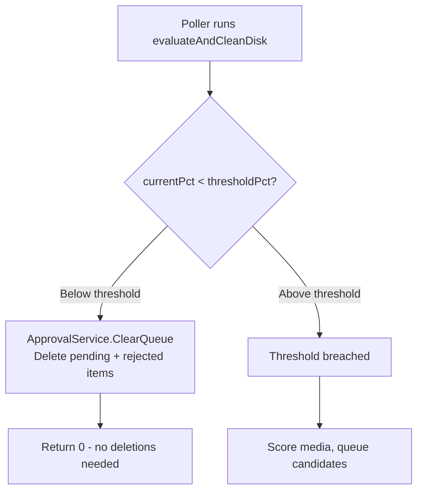

# BASE_URL Login Redirect Fix & Approval Queue Threshold Behavior

**Created:** 2026-03-08T18:01Z
**Status:** ✅ Complete

## Overview

Two related issues affecting Capacitarr's usability:

1. **BASE_URL login redirect bug** — After successful login, the frontend redirects to `/` instead of the configured `BASE_URL`, causing a double-redirect or 404 behind certain reverse proxy configurations.
2. **Approval queue threshold behavior** — The approval queue retains stale items when disk usage drops below threshold. Items should be cleared when no longer needed and only re-populated when the threshold is breached again.

---

## Issue 1: BASE_URL Login Redirect

### Root Cause

The login success handler in `login.vue:147` uses a hardcoded redirect:

```typescript
window.location.href = '/';
```

This bypasses Vue Router's base URL awareness. When `BASE_URL` is set to e.g. `/capacitarr/`, the user is sent to `/` instead of `/capacitarr/`. The backend has a catch-all redirect at `main.go:345` that sends `/` → `cfg.BaseURL`, but this creates a wasteful double-redirect and can fail behind certain reverse proxy configurations that don't pass through the root path.

### Affected Files

| File | Line | Current Code | Issue |
|------|------|-------------|-------|
| `frontend/app/pages/login.vue` | 147 | `window.location.href = '/'` | Hardcoded root path ignores BASE_URL |
| `frontend/app/middleware/auth.global.ts` | 11, 17 | `navigateTo('/login')`, `navigateTo('/')` | Uses Nuxt `navigateTo()` which respects `app.baseURL` — likely fine |
| `frontend/app/composables/useApi.ts` | 21 | `router.push('/login')` | Uses Vue Router which respects base — likely fine |

### Fix

The `login.vue` file already has `const config = useRuntimeConfig()` at line 104. The backend's `rewriteHTML()` in `baseurl.go` rewrites the Nuxt runtime config's `baseURL` value at startup, so `config.app.baseURL` will contain the correct value at runtime.

**Change in `frontend/app/pages/login.vue`:**

```typescript
// Before:
window.location.href = '/';

// After:
window.location.href = config.app.baseURL || '/';
```

The `window.location.href` approach (full page reload) is intentional — the comment on line 143-146 explains this ensures all components pick up auth state. We preserve that behavior while respecting the base URL.

### Verification

The auth middleware and `useApi.ts` use `navigateTo()` and `router.push()` respectively, which go through Vue Router. Since `rewriteHTML()` correctly rewrites `baseURL:"/"` to `baseURL:"/capacitarr/"`, Vue Router's base is set correctly at runtime. These should work without changes, but must be verified during testing.

---

## Issue 2: Approval Queue Threshold Behavior

### Current Behavior

In `poller/evaluate.go:33-44`, when disk usage drops below threshold:

1. `BulkUnsnooze()` is called — resets rejected/snoozed items back to **pending**
2. Pending items are left untouched
3. The approval queue card remains visible with stale candidates

This creates confusion: users see deletion candidates that are no longer relevant because disk usage is fine. Scores are outdated, and a user might approve a stale item, triggering an unnecessary deletion.

### Proposed Behavior

When disk drops below threshold, **clear all non-in-flight items** from the approval queue. When the threshold is breached again, a fresh evaluation produces accurate, current candidates.



**Key constraint:** Items in `StatusApproved` must NOT be cleared — they are actively being processed by the `DeletionService` worker. Only `StatusPending` and `StatusRejected` items should be deleted.

### Implementation Steps

#### Step 1: Add `ApprovalQueueClearedEvent` to event types

**File:** `backend/internal/events/types.go`

Add a new event type following the existing pattern in the Approval Events section, after `ApprovalOrphansRecoveredEvent`:

```go
// ApprovalQueueClearedEvent is published when the approval queue is cleared
// because disk usage dropped below threshold.
type ApprovalQueueClearedEvent struct {
    Count int `json:"count"`
}

// EventType implements Event.
func (e ApprovalQueueClearedEvent) EventType() string { return "approval_queue_cleared" }

// EventMessage implements Event.
func (e ApprovalQueueClearedEvent) EventMessage() string {
    return fmt.Sprintf("Approval queue cleared: %d items removed (disk below threshold)", e.Count)
}
```

#### Step 2: Add `ClearQueue()` method to `ApprovalService`

**File:** `backend/internal/services/approval.go`

Add a new method that hard-deletes pending and rejected items. This replaces the `BulkUnsnooze()` call in the below-threshold path. The method follows the same pattern as `BulkUnsnooze()` — bulk operation, event publishing, logging.

```go
// ClearQueue removes all pending and rejected items from the approval queue.
// Approved items (mid-deletion) are preserved. This is called when disk usage
// drops below threshold to ensure the queue only contains current, actionable
// candidates.
func (s *ApprovalService) ClearQueue() (int, error) {
    result := s.db.Where(
        "status IN ?",
        []string{string(db.StatusPending), string(db.StatusRejected)},
    ).Delete(&db.ApprovalQueueItem{})

    if result.Error != nil {
        return 0, fmt.Errorf("failed to clear approval queue: %w", result.Error)
    }

    count := int(result.RowsAffected)
    if count > 0 {
        s.bus.Publish(events.ApprovalQueueClearedEvent{Count: count})
        slog.Info("Approval queue cleared (disk below threshold)",
            "component", "services", "count", count)
    }

    return count, nil
}
```

#### Step 3: Update poller to call `ClearQueue()` instead of `BulkUnsnooze()`

**File:** `backend/internal/poller/evaluate.go`

Replace the `BulkUnsnooze()` call at line 40 with `ClearQueue()`:

```go
// Before (line 38-41):
// Auto-clear all active snoozes when below threshold — gives a clean slate
// for the next cleanup cycle. Resets rejected items back to pending.
if _, err := p.reg.Approval.BulkUnsnooze(); err != nil {
    slog.Error("Failed to clear active snoozes", "component", "poller", "error", err)
}

// After:
// Clear all pending and rejected items when below threshold — the queue
// should only contain current, actionable candidates. Approved items
// (mid-deletion) are preserved.
if _, err := p.reg.Approval.ClearQueue(); err != nil {
    slog.Error("Failed to clear approval queue", "component", "poller", "error", err)
}
```

#### Step 4: Add SSE subscription in frontend composable

**File:** `frontend/app/composables/useApprovalQueue.ts`

Add the new event type to the SSE subscriptions at line 342, alongside the existing `approval_bulk_unsnoozed` handler:

```typescript
sseOn('approval_queue_cleared', refreshOnEvent);
```

This ensures the frontend immediately refreshes the queue when the backend clears it, so the UI reflects the empty state without waiting for the next poll.

#### Step 5: Add unit tests for `ClearQueue()`

**File:** `backend/internal/services/approval_test.go`

Add tests following the existing pattern using `setupTestDB()`, `newTestBus()`, and `seedPendingItem()`:

1. **Test `ClearQueue` removes pending and rejected items** — seed pending and rejected items, call `ClearQueue()`, verify they are deleted and the count is correct.
2. **Test `ClearQueue` preserves approved items** — seed an approved item alongside pending/rejected items, call `ClearQueue()`, verify the approved item remains.
3. **Test `ClearQueue` publishes event** — subscribe to the event bus, call `ClearQueue()` with items present, verify `ApprovalQueueClearedEvent` is published with the correct count.
4. **Test `ClearQueue` no-op when queue is empty** — call `ClearQueue()` on an empty queue, verify count is 0 and no event is published.

#### Step 6: Update poller evaluate test

**File:** `backend/internal/poller/evaluate_test.go`

Update any existing tests that verify the below-threshold behavior to expect `ClearQueue()` semantics instead of `BulkUnsnooze()` semantics. Specifically, verify that pending items are deleted rather than left in place.

#### Step 7: Verify with `make ci`

Run `make ci` to ensure all linting, tests, and security checks pass.

---

## What About `BulkUnsnooze()`?

The `BulkUnsnooze()` method on `ApprovalService` is no longer called from the poller's below-threshold path. However, it should be **retained** rather than removed:

- It may be useful for future features like a manual "unsnooze all" button
- It has existing tests
- Removing it is a separate cleanup concern

The `CleanExpiredSnoozes()` method is called by the cron scheduler in `jobs/cron.go` and is unaffected by this change — it handles the separate concern of snooze expiry timers.

---

## Testing Plan

### Backend

- Unit tests for `ClearQueue()` as described in Step 5
- Updated poller evaluate tests as described in Step 6
- All existing approval service tests must continue to pass

### Frontend

- Manual test with `BASE_URL=/capacitarr/`:
  - Login redirects to `/capacitarr/` not `/`
  - 401 responses redirect to `/capacitarr/login` not `/login`
  - Auth middleware correctly guards routes
- Manual test with `BASE_URL=/` (default):
  - No regression — login still works as before
- Manual test of approval queue clearing:
  - Set execution mode to "approval"
  - Trigger engine run while above threshold — items appear in queue
  - Lower threshold so disk is below it, trigger another run
  - Verify queue is cleared and card shows empty state
  - Raise threshold again, trigger run — fresh candidates appear

### CI

- `make ci` must pass with all changes

---

---

## Documentation Updates

These changes alter user-visible behavior, so the following documentation must be updated alongside the code changes.

### Step 8: Update `docs/configuration.md` — Approval Queue section

**File:** `docs/configuration.md` (lines 118-135)

The current "Approval Queue" section describes the state machine but does not mention the threshold-based clearing behavior. Add a new subsection after "Orphan Recovery" explaining the automatic queue clearing:

**Add after the "Orphan Recovery" subsection:**

```markdown
### Automatic Queue Clearing

When disk usage drops below the configured threshold, the approval queue is automatically cleared of all **pending** and **rejected** (snoozed) items. This ensures the queue only contains current, actionable deletion candidates — stale items from a previous threshold breach are removed rather than left for manual cleanup.

Items that have already been **approved** and are actively being processed for deletion are preserved and will complete normally.

When the threshold is breached again on a subsequent engine run, the scoring engine re-evaluates all media and populates the queue with fresh candidates based on current disk usage and media metadata.
```

### Step 9: Update `docs/api/openapi.yaml` — SSE event count

**File:** `docs/api/openapi.yaml` (line 1298)

The SSE endpoint description says "39 event types total". Adding `ApprovalQueueClearedEvent` brings this to 40. Update the count:

```yaml
# Before:
config changes, approval actions, and more (39 event types total).

# After:
config changes, approval actions, and more (40 event types total).
```

### Step 10: Update `docs/architecture.md` — if approval flow is documented

The architecture doc does not currently detail the approval queue flow in depth (it focuses on the high-level component diagram). No changes needed here.

---

## Files Modified Summary

| File | Change Type | Description |
|------|-------------|-------------|
| `frontend/app/pages/login.vue` | Bug fix | Use `config.app.baseURL` instead of hardcoded `/` |
| `backend/internal/events/types.go` | New event | Add `ApprovalQueueClearedEvent` |
| `backend/internal/services/approval.go` | New method | Add `ClearQueue()` |
| `backend/internal/services/approval_test.go` | New tests | Tests for `ClearQueue()` |
| `backend/internal/poller/evaluate.go` | Behavior change | Replace `BulkUnsnooze()` with `ClearQueue()` |
| `backend/internal/poller/evaluate_test.go` | Test update | Update below-threshold test expectations |
| `frontend/app/composables/useApprovalQueue.ts` | SSE subscription | Add `approval_queue_cleared` event handler |
| `docs/configuration.md` | Doc update | Add "Automatic Queue Clearing" subsection |
| `docs/api/openapi.yaml` | Doc update | Increment SSE event type count from 39 to 40 |
