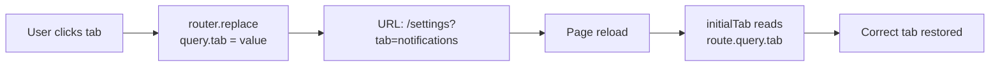

# Discord Release Notification, Tab Persistence, and ZAP Scan

**Date:** 2026-03-16
**Status:** ✅ Complete

This plan covers three independent improvements discussed on 2026-03-16:

1. **Discord release notification** — Announce new releases to a Discord channel from CI
2. **Settings tab persistence** — Preserve the active settings tab across page reloads via URL query param
3. **OWASP ZAP Makefile target** — ✅ Already exists (`make security:zap`)

---

## Item 1: Discord Release Notification from CI

### Goal

When a new tag is pushed and the release pipeline succeeds, post a rich Discord embed to a project announcement channel with the version number, changelog excerpt, and release page link.

### Approach

Add a new `notify` stage to `.gitlab-ci.yml` that runs **after** the `release` stage, ensuring the Discord notification only fires when all release jobs (GoReleaser, Docker build, registry push) have succeeded. The job:
- Lives in the `notify` stage (runs after all `release` stage jobs complete)
- Depends on the `changelog` job for the `release_notes.md` artifact
- Uses `curl` + `jq` to build and POST a Discord webhook payload
- Runs with `allow_failure: true` so Discord outages don't block the `pages` stage
- Is gated by `rules: - if: $CI_COMMIT_TAG`

### Pipeline Stage Order

```yaml
stages:
  - lint
  - test
  - build
  - security
  - release
  - notify    # ← new — fires only after all release jobs succeed
  - pages
```

The `notify` stage guarantees the Discord message is only sent after `release:goreleaser`, `release:docker:build`, and the registry mirror jobs have all completed. The Docker Hub and GHCR mirror jobs have `allow_failure: true`, so a mirror failure won't block the notification — only the canonical GitLab release and registry push must succeed.

### CI Variable

A new masked CI/CD variable is required:

| Variable | Scope | Masked | Protected |
|----------|-------|--------|-----------|
| `DISCORD_RELEASE_WEBHOOK_URL` | Project | ✅ | ✅ |

### Discord Embed Format

The script transforms raw git-cliff output into a clean Discord embed:

```
┌──────────────────────────────────────────────────┐
│ ⚡ Capacitarr  ← clickable → capacitarr.app      │
│                                                    │
│ v1.7.0 Released                          [link →] │
│                                                    │
│ **🚀 Features**                                    │
│ • Overhaul backup import with upsert & validation  │
│                                                    │
│ **🐛 Bug Fixes**                                   │
│ • Fix reka-ui v2 Checkbox binding                  │
│ • Remove misleading login placeholder text         │
│                                                    │
│ **🛡️ Security**                                    │
│ • Comprehensive service layer code audit           │
│ • Update ZAP DAST baseline                         │
│                                                    │
│ ─────────────────────────────────────────────────  │
│ 📄 Release Notes  •  📋 Full Changelog             │
│                                                    │
│ 🔥 From the Cortex                                 │
│ "I aim to misbehave." — Mal                        │
└──────────────────────────────────────────────────┘
```

**Transformations applied to raw release notes:**
- Strip commit hash links: `([abc1234](https://...))` → removed
- Strip scope italics: `*(backup)*` → `**backup:**`
- Convert `### 🚀 Features` → `**🚀 Features**`
- Convert `- ` list items → `• `
- Truncate to 25 lines on a line boundary (not mid-line)
- If truncated, append a "see full release notes" link

**Embed structure:**
- `author.name`: "⚡ Capacitarr" (clickable → `https://capacitarr.app` via `author.url`)
- `title`: "v1.7.0 Released" (clickable → release page via `url`)
- `description`: Transformed release notes (max 25 lines)
- `fields[0]`: Links row — Release Notes, Full Changelog
- `fields[1]`: "🔥 From the Cortex" — random Firefly/Serenity quote with character attribution
- `color`: `5814783` (`#58B9FF` — Capacitarr brand blue)
- No footer — the author link serves as the site reference

**Quote pool** (random selection per release, with character attribution):

| Quote | Character |
|-------|-----------|
| I aim to misbehave. | Mal |
| Shiny. Let's be bad guys. | Jayne |
| We're still flying. That's not much. It's enough. | Mal |
| You can't take the sky from me. | Theme Song |
| Big damn heroes, sir. | Zoe |
| I swear by my pretty floral bonnet, I will end you. | Mal |
| Also, I can kill you with my brain. | River |
| Curse your sudden but inevitable betrayal! | Wash |
| If you can't do something smart, do something right. | Shepherd Book |
| No power in the 'verse can stop me. | River |
| We're gonna explode? I don't wanna explode. | Wash |
| I am a leaf on the wind. Watch how I soar. | Wash |
| Everything's shiny, Captain. Not to fret. | Kaylee |
| My days of not taking you seriously are certainly coming to a middle. | Mal |
| Oh god, oh god, we're all gonna die. | Wash |
| I don't believe there's a power in the 'verse that can stop Kaylee from being cheerful. | Kaylee |
| This is my very favorite gun. | Jayne |
| You know what the first rule of flying is? Love. | Mal |
| I believe that woman is planning to shoot me again. | Mal |
| The human body can be drained of blood in 8.6 seconds given adequate vacuuming systems. | River |
| I can hurt you. | Simon |
| This must be what going mad feels like. | Simon |
| One of you is going to fall and die, and I'm not cleaning it up. | Simon |
| I never back down from a fight. | Zoe |
| Every well-bred petty crook knows the small concealable weapons always go to the far left of the place setting. | Inara |
| What did I say to you about barging into my shuttle? | Inara |
| Mal, if you die, I will kill you. | Inara |

### Implementation Steps

1. Add `DISCORD_RELEASE_WEBHOOK_URL` as a masked, protected CI/CD variable in GitLab project settings (manual step — cannot be automated)
2. Create `scripts/discord-release-notify.sh` — the notification script
3. Add `notify` to the `stages:` list in `.gitlab-ci.yml` (between `release` and `pages`)
4. Add `notify:discord` job to `.gitlab-ci.yml` in the new `notify` stage
5. Test locally with a test webhook URL: `DISCORD_RELEASE_WEBHOOK_URL=<test> CI_COMMIT_TAG=v1.7.0 CI_PROJECT_URL=https://gitlab.com/starshadow/software/capacitarr ./scripts/discord-release-notify.sh`
6. Test in CI by pushing a tag

### Script: `scripts/discord-release-notify.sh`

The script follows the existing pattern of `scripts/docker-build.sh` and `scripts/docker-mirror.sh`:

```bash
#!/bin/sh
# Post a Discord release announcement using the release_notes.md artifact.
# Required environment variables:
#   DISCORD_RELEASE_WEBHOOK_URL — Discord webhook URL (masked CI variable)
#   CI_COMMIT_TAG               — Git tag (e.g., v1.7.0)
#   CI_PROJECT_URL              — GitLab project URL
# Required file:
#   release_notes.md            — Generated by the changelog CI job
set -eu

RELEASE_URL="${CI_PROJECT_URL}/-/releases/${CI_COMMIT_TAG}"
CHANGELOG_URL="${CI_PROJECT_URL}/-/blob/main/CHANGELOG.md"
MAX_LINES=25

# ── Firefly/Serenity quotes with character attribution ──
# One is selected at random for each release notification.
QUOTES='
"I aim to misbehave." — Mal
"Shiny. Lets be bad guys." — Jayne
"Were still flying. Thats not much. Its enough." — Mal
"You cant take the sky from me." — Theme Song
"Big damn heroes, sir." — Zoe
"I swear by my pretty floral bonnet, I will end you." — Mal
"Also, I can kill you with my brain." — River
"Curse your sudden but inevitable betrayal!" — Wash
"If you cant do something smart, do something right." — Shepherd Book
"No power in the verse can stop me." — River
"Were gonna explode? I dont wanna explode." — Wash
"I am a leaf on the wind. Watch how I soar." — Wash
"Everything is shiny, Captain. Not to fret." — Kaylee
"My days of not taking you seriously are certainly coming to a middle." — Mal
"Oh god, oh god, were all gonna die." — Wash
"I dont believe theres a power in the verse that can stop Kaylee from being cheerful." — Kaylee
"This is my very favorite gun." — Jayne
"You know what the first rule of flying is? Love." — Mal
"I believe that woman is planning to shoot me again." — Mal
"The human body can be drained of blood in 8.6 seconds given adequate vacuuming systems." — River
"I can hurt you." — Simon
"This must be what going mad feels like." — Simon
"One of you is going to fall and die, and Im not cleaning it up." — Simon
"I never back down from a fight." — Zoe
"Every well-bred petty crook knows the small concealable weapons always go to the far left of the place setting." — Inara
"What did I say to you about barging into my shuttle?" — Inara
"Mal, if you die, I will kill you." — Inara
'
QUOTE=$(printf '%s\n' "$QUOTES" | grep -v '^$' | shuf -n 1)

# ── Transform release notes for Discord markdown ──
#   - Strip commit hash links: ([abc1234](https://...)) → removed
#   - Convert scope italics: *(scope)* → **scope:**
#   - Convert ### headers → **bold**
#   - Convert - bullets → • bullets
NOTES=$(sed \
  -e 's/ \[\*\*breaking\*\*\]/ ⚠️ **BREAKING**/g' \
  -e 's/ (\[[a-f0-9]*\]([^)]*))//g' \
  -e 's/\*(\([^)]*\))\*/**\1:**/g' \
  -e 's/^### \(.*\)/**\1**/g' \
  -e 's/^- /• /' \
  release_notes.md)

# ── Truncate on a line boundary; append link if truncated ──
TOTAL=$(printf '%s\n' "$NOTES" | wc -l)
if [ "$TOTAL" -gt "$MAX_LINES" ]; then
  NOTES="$(printf '%s\n' "$NOTES" | head -n "$MAX_LINES")

*… [see full release notes](${RELEASE_URL})*"
fi

# ── Build footer links ──
LINKS="📄 [Release Notes](${RELEASE_URL}) • 📋 [Full Changelog](${CHANGELOG_URL})"

# ── Build and send Discord webhook payload ──
jq -n \
  --arg title "${CI_COMMIT_TAG} Released" \
  --arg desc "$NOTES" \
  --arg url "$RELEASE_URL" \
  --arg links "$LINKS" \
  --arg quote "$QUOTE" \
  '{embeds: [{
    author: {name: "⚡ Capacitarr", url: "https://capacitarr.app"},
    title: $title,
    url: $url,
    description: $desc,
    color: 5814783,
    fields: [
      {name: "\u200b", value: $links, inline: false},
      {name: "🔥 From the Cortex", value: $quote, inline: false}
    ]
  }]}' \
| curl -sf -H "Content-Type: application/json" -d @- "$DISCORD_RELEASE_WEBHOOK_URL"
```

### Proposed CI Job

```yaml
notify:discord:
  stage: notify
  image: alpine:latest
  needs:
    - job: changelog
      artifacts: true
  before_script:
    - apk add --no-cache curl jq
  script:
    - scripts/discord-release-notify.sh
  allow_failure: true
  rules:
    - if: $CI_COMMIT_TAG
```

### Files Changed

| File | Change |
|------|--------|
| `scripts/discord-release-notify.sh` | New file — Discord release notification script |
| `.gitlab-ci.yml` | Add `notify` stage + `notify:discord` job (~12 lines) |

---

## Item 2: Settings Tab Persistence via URL Query Param

### Goal

When the user is on the Settings page (`/settings`) and selects a tab (e.g., Notifications), the URL updates to `/settings?tab=notifications`. On page reload, the same tab is restored. This also makes all 6 settings tabs deep-linkable.

### Current Behavior

In `frontend/app/pages/settings.vue` (line 82):

```typescript
const initialTab = computed(() => {
  return route.query.tab === 'backup' ? 'backup' : 'general';
});
```

Only `?tab=backup` is recognized; all other values fall back to `general`. The tab component uses `:default-value` (one-shot) with no URL sync on tab change.

### Proposed Behavior



- The `<UiTabs>` component uses `v-model` instead of `:default-value`
- A `watch` on the model value calls `router.replace({ query: { tab: newValue } })` to keep the URL in sync
- The initial value reads from `route.query.tab` with validation against the known tab values
- Invalid/missing `tab` values default to `general`

### Valid Tab Values

| Value | Tab |
|-------|-----|
| `general` | General (default) |
| `integrations` | Integrations |
| `notifications` | Notifications |
| `backup` | Backup & Restore |
| `security` | Security |
| `advanced` | Advanced |

### Implementation Steps

1. Define a `VALID_TABS` constant array with the 6 valid tab values
2. Replace the `initialTab` computed with a reactive `activeTab` ref that reads from `route.query.tab` (validated against `VALID_TABS`, defaulting to `general`)
3. Change `<UiTabs :default-value="initialTab">` to `<UiTabs v-model="activeTab">`
4. Add a `watch` on `activeTab` that calls `router.replace({ query: { ...route.query, tab: activeTab.value } })` — preserving any other query params
5. Verify the `UiTabs` component (wrapping reka-ui `TabsRoot`) supports `v-model` via `TabsRootProps` / `TabsRootEmits` — confirmed from `frontend/app/components/ui/tabs/Tabs.vue`

### Files Changed

| File | Change |
|------|--------|
| `frontend/app/pages/settings.vue` | Replace `initialTab` with `activeTab` + URL sync (~15 lines changed) |

---

## Item 3: OWASP ZAP Makefile Target

### Status: ✅ Already Complete

The `make security:zap` target already exists in the `Makefile` (lines 115–134). It:

1. Expects a running Capacitarr instance on `localhost:2187` (start with `make build`)
2. Runs `zap-api-scan.py` from `ghcr.io/zaproxy/zaproxy:stable` against the OpenAPI spec at `docs/api/openapi.yaml`
3. Outputs `zap-report.html` and `zap-report.md` to the project root
4. Uses `--network=host` to reach the local instance

A baseline report already exists at `docs/security/zap-baseline-20260316.md` (119 pass, 1 warn, 0 fail).

**No action required.** This item is documented here for completeness.

---

## Execution Order

Items 1 and 2 are completely independent and can be implemented in either order or in parallel.

| Step | Item | Description |
|------|------|-------------|
| 1 | Item 1 | Add `DISCORD_RELEASE_WEBHOOK_URL` CI variable in GitLab (manual) |
| 2 | Item 1 | Create `scripts/discord-release-notify.sh` |
| 3 | Item 1 | Add `notify` stage and `notify:discord` job to `.gitlab-ci.yml` |
| 4 | Item 2 | Implement tab persistence in `settings.vue` |
| 5 | — | Run `make ci` to verify no regressions |
| 6 | — | Test item 2 in browser (reload, deep-link, back/forward) |
| 7 | Item 1 | Test script locally with a test webhook URL |
| 8 | Item 1 | Test in CI by pushing a tag |
