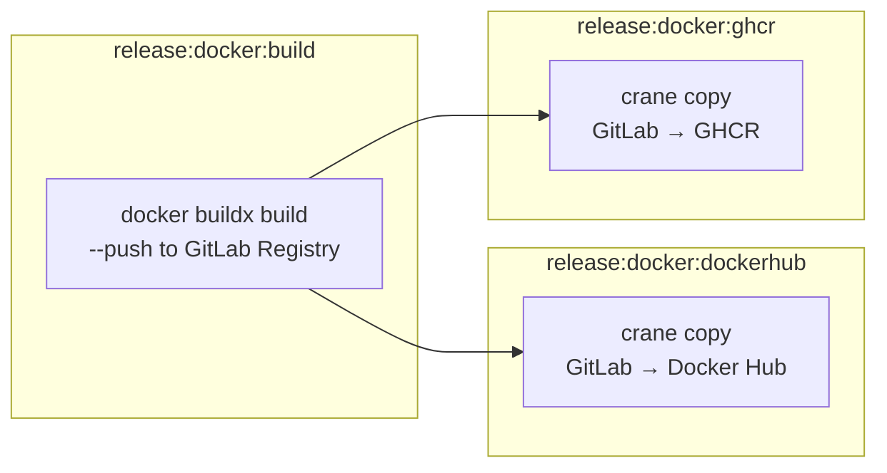

# Multi-Registry Docker Release Pipeline

**Status:** ✅ Complete

## Overview

Add Docker Hub and GHCR as additional container registries for Capacitarr releases, using a build-then-mirror pattern with `crane` for fault isolation and efficiency.

### Registry Addresses

| Registry | Image Path | Existing? |
|----------|-----------|-----------|
| GitLab Container Registry | `registry.gitlab.com/starshadow/software/capacitarr` | ✅ Yes (source of truth) |
| Docker Hub | `docker.io/ghentstarshadow/capacitarr` | ❌ New |
| GHCR | `ghcr.io/ghent/capacitarr` | ❌ New |

### Architecture

The pipeline uses a **build-then-mirror** pattern:

1. **Build once** — `docker buildx build --push` to GitLab Container Registry (using the existing free `CI_JOB_TOKEN`)
2. **Mirror in parallel** — `crane copy` replicates the multi-arch image from GitLab Registry to Docker Hub and GHCR

This approach provides:
- **Fault isolation** — one external registry being down does not block others
- **Efficiency** — the image is built only once; `crane copy` operates at the registry API level without re-pulling/re-pushing layers
- **Debuggability** — logic lives in on-disk shell scripts, not inline CI YAML

### Fault Isolation Matrix

| Scenario | Build Job | Docker Hub Mirror | GHCR Mirror | Pipeline Status |
|----------|-----------|-------------------|-------------|-----------------|
| All healthy | ✅ | ✅ | ✅ | ✅ Success |
| Docker Hub down | ✅ | ❌ warning | ✅ | ⚠️ Warning — retry DH later |
| GHCR down | ✅ | ✅ | ❌ warning | ⚠️ Warning — retry GHCR later |
| GitLab Registry down | ❌ | skipped | skipped | ❌ Failed — source of truth unavailable |

### Prerequisites (already completed)

CI/CD variables must be configured in GitLab at Settings → CI/CD → Variables:

| Variable | Purpose | Protected | Masked |
|----------|---------|-----------|--------|
| `DOCKERHUB_USERNAME` | Docker Hub login username | ✅ | ❌ |
| `DOCKERHUB_TOKEN` | Docker Hub access token (Read & Write) | ✅ | ✅ |
| `GHCR_USERNAME` | GitHub username | ✅ | ❌ |
| `GHCR_TOKEN` | GitHub PAT with `write:packages` | ✅ | ✅ |

---

## Implementation Steps

### Step 1: Create `scripts/docker-build.sh`

Create a shell script that replaces the current inline build logic in `release:docker`. This script:
- Computes version and tag strings from `CI_COMMIT_TAG`
- Determines whether the release is stable or pre-release
- Runs `docker buildx build --push` with the appropriate tags
- Pushes only to GitLab Container Registry (source of truth)

Tags applied:
- Every release: `:VERSION`, `:latest`
- Stable releases only: `:stable`, `:MAJOR`, `:MAJOR.MINOR`

The script must use `set -euo pipefail`, validate required environment variables, and emit clear log messages for CI output.

### Step 2: Create `scripts/docker-mirror.sh`

Create a shell script that mirrors a multi-arch image from GitLab Container Registry to a target registry using `crane copy`. This script:
- Accepts the target registry path as its first argument
- Copies `:VERSION` and `:latest` tags
- Conditionally copies `:stable`, `:MAJOR`, `:MAJOR.MINOR` for stable releases
- Uses `crane copy` which transfers at the registry manifest level (no layer re-upload)

### Step 3: Update `.gitlab-ci.yml`

Replace the existing `release:docker` job (lines 158-192) with three jobs:

**`release:docker:build`** — builds and pushes to GitLab Registry
- Image: `docker:latest` with `docker:dind` service
- `before_script`: set up buildx, login to GitLab Registry
- `script`: calls `scripts/docker-build.sh`
- Runs on tag push only

**`release:docker:dockerhub`** — mirrors to Docker Hub
- Image: `gcr.io/go-containerregistry/crane:latest` (entrypoint override)
- `needs`: `release:docker:build`
- `before_script`: `crane auth login` to GitLab Registry and Docker Hub
- `script`: calls `scripts/docker-mirror.sh "docker.io/ghentstarshadow/capacitarr"`
- `allow_failure: true` for fault isolation
- Runs on tag push only

**`release:docker:ghcr`** — mirrors to GHCR
- Image: `gcr.io/go-containerregistry/crane:latest` (entrypoint override)
- `needs`: `release:docker:build`
- `before_script`: `crane auth login` to GitLab Registry and GHCR
- `script`: calls `scripts/docker-mirror.sh "ghcr.io/ghent/capacitarr"`
- `allow_failure: true` for fault isolation
- Runs on tag push only

### Step 4: Update `docs/releasing.md`

Update the releasing documentation to reflect:
- The three-registry architecture
- All three pull paths for each tag pattern
- The build-then-mirror pipeline flow
- Updated CI Pipeline Jobs table with the new job names
- Updated Release Artifacts section with all registry paths

### Step 5: Update `README.md` and `docs/quick-start.md`

Update the Docker Compose examples and pull instructions to show all three registries as options, with Docker Hub as the primary (since it requires no registry prefix).

### Step 6: Post-deployment manual steps

After the first successful release with the new pipeline:
1. **Docker Hub** — set repository description and full README at https://hub.docker.com/r/ghentstarshadow/capacitarr
2. **GHCR** — change package visibility from Private to Public at https://github.com/ghent?tab=packages

### Step 7: Verify with `make ci`

Run `make ci` to ensure all local checks pass before committing. Note that this validates linting and tests — the Docker mirror jobs themselves can only be fully tested by pushing a tag and triggering the CI pipeline.
