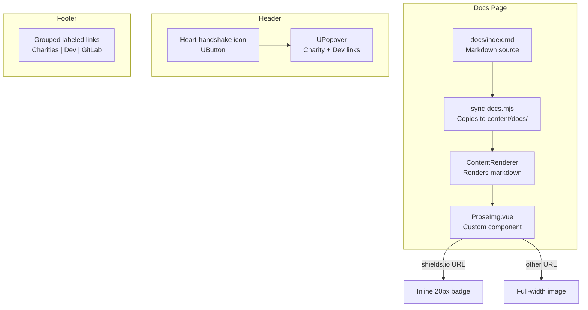

# Pages Site Fixes: Badges, About Section, Footer Icons, Navbar Donation Icon

**Status:** ✅ Complete
**Created:** 2026-03-08

## Overview

Four fixes for the capacitarr.app Pages site:

1. **Shields.io badges are huge** — Nuxt Content's `ProseImg` component applies `w-full` to all images, overriding the CSS fix
2. **No About section on docs page** — `docs/index.md` lacks a proper About section
3. **Footer donation icons are too similar** — hearts and coffee cups are indistinguishable at icon size
4. **Navbar donation icon** — add a heart icon in the header that opens a popover with charity/tip jar links

## Root Cause Analysis

### Shields.io Badges

Confirmed via Puppeteer DOM inspection. Every badge `` has:

```
classes: "rounded-md w-full will-change-transform cursor-zoom-in"
inProse: false
closestProseAncestor: "NONE"
display: "block"
maxWidth: "100%"
width: "752px"
```

The existing CSS rule in `main.css` targets `.prose img[src*="img.shields.io"]` — this never matches because:
- Images are NOT inside a `.prose` wrapper
- The `ProseImg` component from `@nuxt/ui` v4 adds `w-full` as a Tailwind utility class
- `display: block` prevents inline rendering

### Footer Icons

The footer in `app.config.ts` uses these icons:

| Link | Icon | Visual Problem |
|------|------|----------------|
| UAnimals | `i-lucide-heart` | Looks like GitHub Sponsors heart |
| ASPCA | `i-lucide-paw-print` | Small, hard to see |
| GitHub Sponsors | `i-simple-icons-githubsponsors` | Looks like UAnimals heart |
| Ko-fi | `i-simple-icons-kofi` | Looks like Buy Me a Coffee |
| Buy Me a Coffee | `i-simple-icons-buymeacoffee` | Looks like Ko-fi |
| GitLab | `i-simple-icons-gitlab` | Distinct |

Three heart-like icons and two coffee-cup icons at footer size are indistinguishable.

---

## Steps

### Step 1: Create custom ProseImg component for badge detection

**File:** `site/app/components/content/ProseImg.vue` (new)

Create a custom `ProseImg` component that overrides the default from `@nuxt/ui`. Nuxt Content automatically discovers components in `app/components/content/` — this is the documented, framework-native override mechanism.

The component detects shields.io badge URLs and renders them inline at 20px height without the full-width/rounded/zoom classes. All other images get the standard `ProseImg` treatment.

```vue
<script setup lang="ts">
const props = defineProps<{
  src: string
  alt?: string
  width?: string | number
  height?: string | number
}>()

const isBadge = computed(() =>
  props.src?.includes('shields.io')
  || props.src?.includes('img.shields')
)
</script>

<template>
  
  
</template>

<style scoped>
.badge-inline {
  display: inline;
  height: 20px;
  width: auto;
  max-width: none;
  vertical-align: middle;
  border-radius: 3px;
}
</style>
```

Also remove the now-unnecessary CSS rule from `main.css` lines 122-129.

---

### Step 2: Add About section to docs/index.md

**File:** `docs/index.md`

Add an `## About` heading before the existing footer line. This will appear in the docs site table of contents and provide the missing About section.

```markdown
## About

**Capacitarr** is free, open-source software created by **Ghent Starshadow**.
Licensed under [PolyForm Noncommercial 1.0.0](https://gitlab.com/starshadow/software/capacitarr/-/blob/main/LICENSE).
Built with Go, Nuxt 4, and SQLite.

🇺🇦 I stand with Ukraine. This project is built with the belief that freedom,
sovereignty, and self-determination matter — for people and for software.

---

**Support animal rescue:** [UAnimals](https://uanimals.org/en/) · [ASPCA](https://www.aspca.org/ways-to-help) — or support the developer: [GitHub Sponsors](https://github.com/sponsors/ghent) · [Ko-fi](https://ko-fi.com/ghent) · [Buy Me a Coffee](https://buymeacoffee.com/ghentgames)

*Author: Ghent Starshadow*
```

---

### Step 3: Fix footer icons — replace with grouped, labeled links

**File:** `site/app/components/AppFooter.vue`

Replace the flat icon row with two visually grouped sections. Instead of relying on icon-only buttons that are indistinguishable, use small labeled links with separators.

The footer right section becomes:

```
🐾 UAnimals · ASPCA  |  💜 Sponsor · Ko-fi · BMC  |  [GitLab icon]
```

This replaces the current `v-for` loop over `footer.links` with explicit grouped rendering. The charity links use text labels with small icons, the developer links use text only, and GitLab keeps its icon button.

**File:** `site/app/app.config.ts`

Restructure the footer config to separate charity links, developer links, and utility links into distinct arrays — or handle the grouping entirely in `AppFooter.vue` with hardcoded links since the footer content is static.

The simpler approach: hardcode the grouped footer in `AppFooter.vue` and remove the dynamic `footer.links` loop. The footer content never changes dynamically.

---

### Step 4: Add donation popover icon to the header

**File:** `site/app/components/AppHeader.vue`

Add a heart icon button in the header's right section, between the color mode button and the GitLab link. Clicking it opens a `UPopover` with:

- **Support Animal Rescue** heading
- A message: "Capacitarr is free software. If it saves you time, we'd love for you to donate to animal rescue instead of supporting us directly."
- UAnimals and ASPCA links with descriptions
- Separator
- **Support the Developer** subheading (smaller, secondary)
- GitHub Sponsors, Ko-fi, Buy Me a Coffee links

```vue
<UPopover>
  <UButton
    icon="i-lucide-heart-handshake"
    color="neutral"
    variant="ghost"
    aria-label="Support & Donate"
  />
  <template #content>
    <div class="p-4 max-w-xs space-y-3">
      <p class="text-sm font-semibold">Support Animal Rescue 🐾</p>
      <p class="text-xs text-muted">
        Capacitarr is free software. If it saves you time,
        we'd love for you to donate to animal rescue instead
        of supporting us directly.
      </p>
      <!-- Charity links -->
      <!-- Separator -->
      <!-- Developer links (smaller, secondary) -->
    </div>
  </template>
</UPopover>
```

The `i-lucide-heart-handshake` icon is visually distinct from the plain heart and communicates "giving/support" clearly. The messaging emphasizes the preference for charity donations over developer tips.

---

### Step 5: Remove old shields.io CSS rule from main.css

**File:** `site/app/assets/css/main.css`

Remove lines 121-129:

```css
/* ═══════════════════════════════════════════
   SHIELDS.IO BADGE SIZING
   ═══════════════════════════════════════════ */
.prose img[src*="img.shields.io"] {
  display: inline;
  height: 20px;
  width: auto;
  vertical-align: middle;
}
```

This rule never matched and is now superseded by the custom `ProseImg` component.

---

### Step 6: Verify with site build

Build the site locally to verify:
- Badges render inline at 20px height
- About section appears on docs page with TOC entry
- Footer shows grouped, labeled donation links
- Header popover works correctly

---

## File Change Summary

| File | Change | Description |
|------|--------|-------------|
| `site/app/components/content/ProseImg.vue` | New | Custom ProseImg with badge detection |
| `site/app/assets/css/main.css` | Edit | Remove dead shields.io CSS rule |
| `docs/index.md` | Edit | Add About section |
| `site/app/components/AppFooter.vue` | Edit | Grouped labeled footer links |
| `site/app/app.config.ts` | Edit | Simplify footer config |
| `site/app/components/AppHeader.vue` | Edit | Add donation popover icon |

## Architecture


